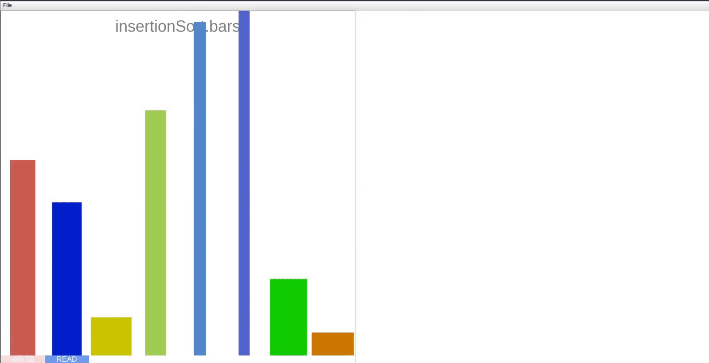

= Visualization for Sort Algorithms

Goals:

- Visualize the sorting of an array of Bar objects
- The sorting algorithm is written by first semester students; their code should not care about the visualization, i.e. no explizit draw calls in the student code
    ** The class `Bar` is given in this repository.
    ** The class `Sort` contains an example of student code.




== Build and Run

```
./gradlew jar
java -cp ./build/classes/java/main -javaagent:./build/libs/sort-instrumentation-0.1.jar Sort 2407 30535 11884 14670 2885
```

=== Customization

```
NUM_SMALL_ARRAYS_X=3 NUM_SMALL_ARRAYS_Y=3 DRAW_PAUSE_LENGTH=100 java -cp ./build/classes/java/main -javaagent:./build/libs/sort-instrumentation-0.1.jar=-v Sort 2407 30535 11884 14670 2885 4541 5145 14485 41 5844 6484
```

== Technical Details

The general idea is that we use a Java agent to instrument the student code. The agent adds additional code around all byte code instructions which read or modify an array of type `Bar[]`. This additional code sends the array to out visualization methods which then draw the arrays.

== Instructions for students

The sort-instrumentation-0.1.jar must be given to students.

1. Students compile their code using the command line. If variable names should be visible, they must use `javac -g Sort.java` (or whatever the name of their file is).
2. Students then run `java -javaagent:sort-instrumentation-0.1.jar Sort`
3. `p` can be used to pause the animation; `s` can be used to step through the animation one frame at a time.

== Credits

- Based on an idea by Carsten Krollmann
- Written by Markus Brenneis
- Using StdDraw by Robert Sedgewick and Kevin Wayne